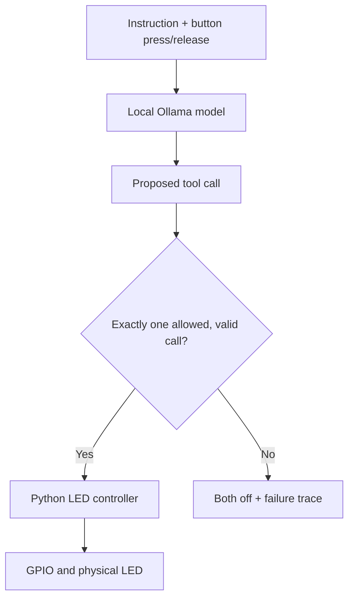
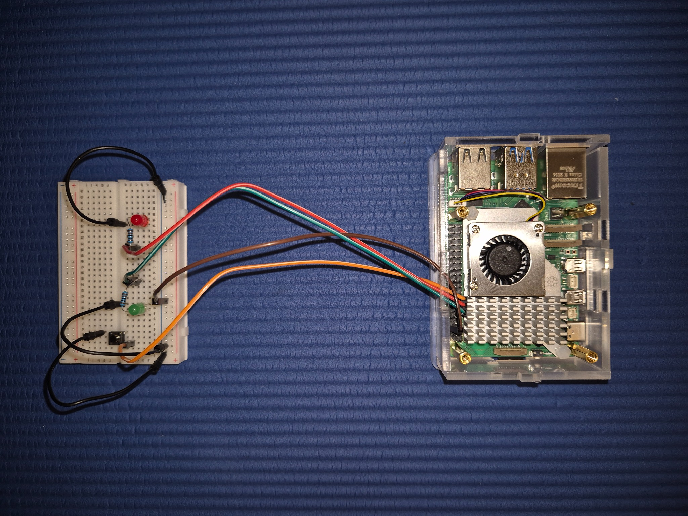

# Week 05 — AI button

A physical button triggers a local language model to interpret an instruction.
Python validates its proposed `set_led` call before changing a green or red LED.
The default model is `gemma4:e2b`, running on a Raspberry Pi 5 (8 GB).

## Objective and learning points

Build a physical gadget with a local model and validated GPIO tools. This extends
Week 2's software tool calling into GPIO hardware. The button triggers a decision;
the typed instruction supplies its meaning. Simply cycling colours would not need
a language model.

- Read a debounced GPIO input and drive two outputs.
- Keep model proposals separate from permission to execute hardware actions.
- Validate the tool name, argument schema, and number of calls.
- Handle slow inference sequentially, without queued or concurrent requests.
- Clear the LEDs on application failure or normal exit and retain an audit trace.
- Distinguish valid arguments from a semantically correct decision, and commanded
  LED state from independently measured physical state.



| Meaning | Tool argument | Hardware result |
|---|---|---|
| Ready or successful; explicit green | `green` | Green on, red off |
| Problem or failure; explicit red | `red` | Red on, green off |
| Clear; explicit off; ambiguous or unsupported | `off` | Both off |

These are user-supplied indications, not actual health measurements of the Pi.
There is one bounded model request per trigger; no follow-up narration request,
autonomous retry loop, or persistent conversation history in this implementation.

## Completed hardware reference



[Open the original full-resolution photo](assets/ai-button-hardware.jpg).
The supplied JPEG is preserved byte-for-byte. The board is rotated in this photo;
use physical pin numbers rather than copying a left/right position blindly.

## Hardware and wiring

- Raspberry Pi 5, 8 GB, Raspberry Pi OS, microSD and suitable power supply.
- Breadboard, one standard four-legged momentary tactile button.
- Separate red and green two-legged LEDs, **one 1 kΩ resistor per LED**.
- Male-to-female wires for Pi-to-breadboard connections and male-to-male wires
  for breadboard jumpers.
- SSH terminal on a laptop; runtime and inference remain on the Pi.

Shut down with `sudo poweroff`, wait for shutdown, and disconnect power before
changing wires. GPIO is 3.3 V; physical pins 2 and 4 supply 5 V and are not used.
Do not omit the LED resistors. Keep exposed leads from touching other contacts.

| Purpose | BCM number in Python | Physical header pin |
|---|---:|---:|
| Green LED | GPIO17 | 11 |
| Red LED | GPIO27 | 13 |
| Button input | GPIO22 | 15 |
| Shared ground | — | 6 |

GPIO Zero uses BCM numbering: `LED(17)` refers to physical pin 11, not pin 17.
Run `pinout` on Raspberry Pi OS to inspect its header reference.

Each LED circuit is: GPIO → 1 kΩ resistor → anode (long leg) → LED → cathode
(short leg / flat side) → ground. Resistor direction does not matter.
The button connects GPIO22 to ground only when pressed. Python enables its
internal pull-up, so no external button resistor is required.

### Understanding the breadboard

For each numbered column, a–e form one connected group and f–j form another.
The centre gap separates those groups. Numbered groups are not internally
connected to the red/blue rails. A rail is only connected to Pi ground after
adding a wire; its blue colour is a label, not an electrical connection.
Top and bottom rails are separate, and some breadboards split a rail in the
middle. Use a verified connected section, or bridge sections explicitly.

An example layout on the breadboard used in this session:

| Item | Hole(s) / connection |
|---|---|
| Pi ground, physical pin 6 | Upper blue rail |
| Green LED anode / cathode | a10 / a11 |
| Green resistor | b10 to b15 |
| GPIO17 wire | c15 |
| Green ground jumper | b11 or c11 to upper blue rail |
| Red LED anode / cathode | a20 / a21 |
| Red resistor | b20 to b25 |
| GPIO27 wire | c25 |
| Red ground jumper | b21 to upper blue rail |
| Button legs, if they fit naturally | e3, e5, f3, f5, straddling the gap |
| GPIO22 wire | d3 |
| Button ground jumper | g5 to upper blue rail |

This is a reproducible example, not a pixel-level annotation of the photo.
Using c11 instead of b11 is equivalent; b12 is a different group. A standard
four-legged tactile button has two internally connected pairs. Select diagonal
contacts to reach opposite switched contacts. Do not force incompatible leg
spacing; if unsure, verify open-circuit when released and continuity when pressed
with a multimeter while power is disconnected.

## Files

| File | Purpose |
|---|---|
| `hardware_test.py` | Green → red → green follows the button; no model |
| `led_tools.py` | Pydantic arguments, controller, dispatch and rejection checks |
| `model_decision_test.py` | Model/tool schema, shared request function, dry run |
| `ai_button.py` | Physical trigger, validated execution, failure cleanup and JSONL log |
| `timing_report.py` | Offline timing summary and per-request timings |
| `requirements.txt` | Python dependencies; GPIO packages installed through apt |
| `results/reported_observations.json` | Reported request timings and later latency observation |
| `results/qwen_reported_traces.jsonl` | Four detailed Qwen traces supplied in the session |

The scripts reproduce the working flow developed during the session. Repo
conveniences added for reproducibility: model/host environment settings, a shared
request function, deferred GPIO imports, and an offline timing reporter.
Importing a script does not open GPIO devices or run its main function.

## Setup on the Pi

These standalone scripts need Python **3.10+**; they do not require the newer
Python version used by the earlier notebooks. SSH example:

```bash
ssh monaj@edgepi.local
```

Run the following on the Pi, adjusting the checkout path if necessary:

```bash
sudo apt update
sudo apt install python3-gpiozero python3-lgpio python3-venv
cd ~/ollama_python/src/week_05
python3 -m venv --system-site-packages .venv
source .venv/bin/activate
python -m pip install -r requirements.txt
export GPIOZERO_PIN_FACTORY=lgpio
ollama list
```

`--system-site-packages` exposes the apt-installed GPIO packages inside the venv.
Use GPIO Zero with lgpio on the Pi 5, rather than older direct-register GPIO
examples. The user must have GPIO access (normally membership of the `gpio` group).
Ollama must already be installed and serving locally. If needed, download models:

```bash
ollama pull gemma4:e2b
ollama pull qwen3.5:4b
```

Configuration defaults: `MODEL=gemma4:e2b`,
`OLLAMA_HOST=http://localhost:11434`, client timeout 120 seconds,
temperature 0, context 2048, output cap 128, thinking disabled, streaming off,
and keep-alive 10 minutes. The HTTP client timeout is not a hard wall-clock
deadline for every possible request. The same request function serves both tests
and the full gadget. Environment values are read when the process starts.

## Run the stages in order

### 1. Hardware only

```bash
python hardware_test.py
```

Expected: green for two seconds, red for two seconds, then green while the button
is held and off on release. `bounce_time=0.05` suppresses mechanical contact
bounce. Ctrl+C stops the test and clears outputs. All three checks passed on the
user's Pi.

### 2. Validated hardware tool

```bash
python led_tools.py
```

Expected: green → red → off, then four rejected requests: blue, an extra pin
argument, a missing colour, and an unknown tool. All passed on the user's Pi.
The validator raises before writing GPIO; it does not independently change the
previous state on rejection. The enclosing agent's error handler explicitly
clears outputs on failure.

`SetLEDArgs` requires `Literal["green", "red", "off"]`, forbids extra arguments
and enables strict validation. `execute()` allowlists `set_led`; the model never
receives arbitrary pin selection, shell execution, or generated Python execution.
The controller turns both LEDs off before enabling the chosen one.

### 3. Model decision dry run

```bash
MODEL=gemma4:e2b python model_decision_test.py
MODEL=qwen3.5:4b python model_decision_test.py
```

Enter one instruction at a time; type `quit` to end. No GPIO output is changed.
The tool schema comes from `SetLEDArgs.model_json_schema()`. A response must have
exactly one call with the allowed name and valid arguments before execution is
possible. Empty assistant text with a valid tool call is normal here.

| Instruction | Expected colour |
|---|---|
| Turn the green LED on. | green |
| The operation completed successfully. | green |
| The operation failed. | red |
| Clear the indicator. | off |
| Turn on a blue LED. | off |

Qwen passed all five dry-run cases. The first reported request took 66.65 s;
later requests took 23.75, 23.70, 23.70 and 23.78 s. The first-run slowdown might
include loading, but no timing breakdown was supplied for that dry-run request.
Gemma also returned `off` for the unsupported blue request; no exact timing was
provided for that specific request. Schema validity and decision correctness are
separate: a valid red call for a success instruction would still be incorrect.

### 4. Full button gadget

```bash
MODEL=gemma4:e2b python ai_button.py
```

Type an instruction. When ready, press and release the button. The LEDs clear on
press; inference begins after release. The accepted action remains indicated
until the next trigger or exit. Extra presses during inference are not queued;
the loop handles only one request at a time and requires a fresh press next time.
The application stops after executing the tool, without a second model request
to narrate it. Ctrl+C or `quit` clears both LEDs and closes GPIO resources.

### 5. Failure checks

The user confirmed all three on the working gadget:

1. Repeated presses during inference do not launch overlapping/replayed requests.
2. Ctrl+C while an LED is on turns both off on exit.
3. Connection failure clears both LEDs, records an error and returns to the prompt.

Reproduce connection failure without source edits, using an unused local port:

```bash
OLLAMA_HOST=http://localhost:11435 python ai_button.py
```

Trigger a request, then quit. Run the normal command again to restore the default
host. This replaces the manual host edit used in the session. A missing/invalid
call or HTTP failure is also caught by the application fallback. No rollback or
cleanup is guaranteed after forced termination, power loss, or hardware failure.

## Traces and latency investigation

`ai_button_events.jsonl` is appended beside the script and ignored by Git.
Each completed attempt records UTC timestamp, model, instruction, raw model
message when available, execution/failure status, commanded result and timings.
Failures include error type/message; interrupted attempts may have no trace row.
The file can contain user-entered text, so review it before sharing or committing.

- `request_and_action_s`: request start through validation and GPIO dispatch.
- `press_to_action_s`: also includes waiting for button release after the press.
- Ollama `load_duration`, `prompt_eval_duration`, `eval_duration`: nanoseconds.
- `prompt_eval_count`, `eval_count`: input/output token counts.
- `commanded_state`: software command, not optical confirmation of LED output.

Inspect live traces and compare the last successful requests:

```bash
tail -n 4 ai_button_events.jsonl
python timing_report.py ai_button_events.jsonl --last 4
python timing_report.py results/qwen_reported_traces.jsonl
```

`--last` selects N successful rows across all models before grouping. Keep
separate trace copies for matched before/after sessions; a whole-file mean can
hide differences between the earlier 1.4-second and later ~5-second Gemma runs.

## Reported results (7 October 2026)

These observations were supplied by the user, not collected by an automated
benchmark in this checkout. Four full-gadget examples per model:

| Model | Instructions → expected/observed colours | Request + action (s) |
|---|---|---|
| gemma4:e2b | Ready → green | 1.27 |
| gemma4:e2b | System error → red | 1.38 |
| gemma4:e2b | All tests passed → green | 1.39 |
| gemma4:e2b | Finish and turn off → off | 1.49 |
| qwen3.5:4b | Everything is ready. → green | 24.64 |
| qwen3.5:4b | The operation failed. → red | 24.63 |
| qwen3.5:4b | Clear the indicator. → off | 24.59 |
| qwen3.5:4b | Done → green | 25.02 |

| Model | Correct actions in these examples | Mean (s) | Range (s) |
|---|---:|---:|---:|
| gemma4:e2b | 4/4 | 1.38 | 1.27–1.49 |
| qwen3.5:4b | 4/4 | 24.72 | 24.59–25.02 |

Gemma was about 18× faster in these reported runs. Instructions differ, so this
is a comparison of observed requests, not a matched-prompt benchmark or a general
claim about model quality. A later Gemma session was
reported as averaging approximately **5 s**; its sample count and timing traces
were not supplied, so the cause remains unresolved and this is not combined
with the four earlier exact measurements.

### Qwen latency breakdown

The four detailed archived Qwen traces give:

| Component | Mean time | Approximate share |
|---|---:|---:|
| Loading | 0.002 s | Negligible |
| Prompt processing | 17.57 s | 71% |
| Generating the tool call | 7.14 s | 29% |
| Remaining request/action overhead | 0.012 s | Negligible |
| Request + action | 24.72 s | 100% |

About 392 input tokens and 26 generated tokens per request; aggregate generation
speed was approximately 3.64 tokens/s. Prompt processing dominates these traces.
Loading is already negligible with the model resident. Reducing `num_predict`
alone does not shorten an answer that naturally finishes at 26 tokens.

For the later Gemma ~5-second runs, inspect the same fields before attributing a
cause. Increased loading time suggests residency/cold-start effects; increased
prompt time suggests more input work or changed processing speed; generation
time must be interpreted with `eval_count`. Competing workloads and thermal
throttling are possible hypotheses, not established explanations. Optional Pi
checks: `vcgencmd measure_temp` and `vcgencmd get_throttled` (the latter includes
historical flags as well as current conditions). Temperature alone does not
establish throttling. Compare identical prompts/settings under similar conditions.

## Offline verification and references

From the repository root, with Pydantic 2 installed:

```bash
python -m unittest discover -s tests -p 'test_week_05.py' -v
```

The tests use fake outputs to verify that rejected calls cannot write GPIO,
colour switching clears both outputs first, and missing/multiple/invalid calls
are rejected. They need neither a Pi nor an Ollama server. Physical and live
model verification are the separate user-confirmed checks documented above.

- [Raspberry Pi GPIO documentation](https://www.raspberrypi.com/documentation/computers/raspberry-pi.html#gpio-and-the-40-pin-header)
- [GPIO Zero basic recipes and numbering](https://gpiozero.readthedocs.io/en/stable/recipes.html)
- [GPIO Zero Button API](https://gpiozero.readthedocs.io/en/stable/api_input.html#button)
- [GPIO Zero pin factories](https://gpiozero.readthedocs.io/en/stable/api_pins.html)
- [Ollama tool calling](https://docs.ollama.com/capabilities/tool-calling)
- [Pydantic model configuration](https://docs.pydantic.dev/latest/concepts/config/)
